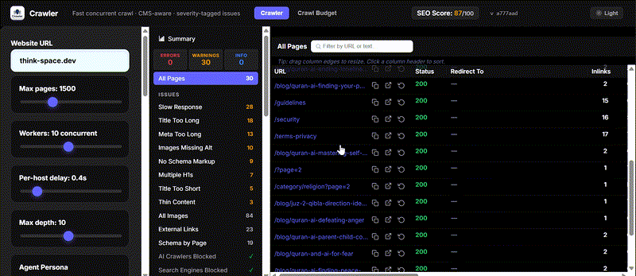

<div align="center">


**Enterprise-Grade, Self-Hosted SEO Crawler & Technical Auditing Platform**

[](#installation)
[](https://www.python.org/downloads/)
[](LICENSE)
[](#)
[](#)

</div>

<br />

## 📖 About The Project

**Crawler** is an enterprise-grade, self-hosted technical SEO platform designed to be the ultimate open-source alternative to premium tools like Screaming Frog, Sitebulb, and Ahrefs. Built for SEO professionals, developers, and website owners, it provides limitless crawling and deep technical auditing without the burden of subscription fees or per-URL limits.

At its core, Crawler is driven by a high-performance, multithreaded engine capable of analyzing thousands of URLs concurrently. It goes beyond basic HTML parsing by offering headless JavaScript rendering for modern frameworks (React, Vue, SPA) and intelligent CMS detection. 

Unlike cloud-based SEO platforms, **Crawler runs 100% locally**. Your website data, crawl histories, and architectural insights never leave your machine, ensuring absolute privacy and security.

---

### 🎥 See it in Action

<div align="center">
  
</div>

---

## ✨ Key Features

### 🕸️ Powerful Crawling Engine
- **Unlimited URLs:** Crawl 10 or 10,000+ pages concurrently without paying a cent.
- **CMS-Aware:** Auto-detects Shopify, WordPress, Webflow, Wix, Squarespace, and more.
- **Smart Retry & Rate Limiting:** Exponential backoff prevents you from being blocked by servers.
- **Headless JS Rendering:** Optional Playwright integration to render React, Vue, and SPA frameworks.

### 📊 Deep SEO Auditing
- **On-Page SEO:** Validate Titles, Meta Descriptions, H1 tags, and Canonical tags.
- **Structured Data:** Detects JSON-LD and Microdata (Schema.org).
- **Technical Health:** Uncover broken links, redirect chains, 4xx/5xx errors, and mixed content.
- **Indexability:** Checks `noindex`, `robots.txt`, and AI-crawler blocking.
- **Content Quality:** Flags thin content and near-duplicate pages.

### 📈 Live Ranking & Export
- **Live SEO Ranking:** Track website rankings in real-time right alongside your technical audit.
- **Bulk Export & Reporting:** Generate `.csv` and `.xlsx` (Excel) reports instantly for Titles, H1s, Missing Alt Texts, Hreflang, and Redirect Chains.
- **Issue Prioritization:** Group issues by severity (Errors / Warnings / Info) to prioritize the highest-impact fixes.

---

## 🆚 How it Compares

| Feature | Crawler (This Project) | Screaming Frog (Free) | Screaming Frog (Paid) | Ahrefs |
|---------|------------------------|-----------------------|-----------------------|--------|
| **URL Limit** | **Unlimited** | 500 | Unlimited | Per-credit |
| **Price** | **Free** | Free | £199 / yr | $129+ / mo |
| **Live SEO Ranking** | ✅ **Yes** | ❌ No | ❌ No | ❌ No |
| **Data Export** | ✅ **CSV & XLSX** | ✅ CSV/Excel | ✅ CSV/Excel | ✅ CSV |
| **Self-Hosted** | ✅ Yes | ✅ Yes | ✅ Yes | ❌ Cloud |
| **Open Source** | ✅ Yes | ❌ No | ❌ No | ❌ No |

---

## ⚙️ Quick Install

**Prerequisite:** Requires Python 3.10+.

```bash
git clone https://github.com/alfa546/Crawler.git
cd Crawler
python3 -m venv venv
source venv/bin/activate  # On Windows: venv\Scripts\activate
pip install -r requirements.txt
python3 app.py
```
Then, open [http://localhost:5002/](http://localhost:5002/) in your browser.

*(For SPA rendering support, install Playwright: `pip install playwright && playwright install chromium`)*

### 📦 One-Line Auto-Installers

We provide automated setup scripts that register Crawler to start on boot and auto-update daily.

**Linux (Ubuntu/Debian/Mint)**
```bash
curl -fsSL https://raw.githubusercontent.com/alfa546/Crawler/main/install.sh -o install.sh && chmod +x install.sh && ./install.sh
```

**macOS**
```bash
curl -fsSL https://raw.githubusercontent.com/alfa546/Crawler/main/install-macos.sh -o install-macos.sh && chmod +x install-macos.sh && ./install-macos.sh
```

**Windows 10/11 (PowerShell)**
```powershell
[Net.ServicePointManager]::SecurityProtocol = [Net.SecurityProtocolType]::Tls12; iwr https://raw.githubusercontent.com/alfa546/Crawler/main/install-windows.ps1 -OutFile install.ps1; powershell -ExecutionPolicy Bypass -File .\install.ps1
```

---

## 💡 Usage Guide

1. Enter a website URL in the main dashboard.
2. Click **Apply recommendations** for your detected CMS to automatically configure settings.
3. Tweak parameters if needed (Max Pages, Workers, Render JS).
4. Hit **Start crawl**. 
5. The **Summary Dashboard** will provide live results. Once completed, download bulk reports via `.csv` or `.xlsx`.

---

## 🛠️ Architecture & Tech Stack
- **Backend:** Python 3.10+, Flask, requests, BeautifulSoup4, lxml.
- **Frontend:** Custom redesigned HTML/CSS/JS (Jinja2 Templates).
- **Concurrency:** ThreadPoolExecutor for fast, scalable concurrent crawls.
- **Data Processing:** Openpyxl and standard libraries for `.xlsx` and `.csv` generation.

---

## 🤝 Contributing

Contributions are warmly welcome! Whether you are reporting bugs, improving the new UI, or adding new features (like Core Web Vitals or Custom XPath Extraction), please read our [CONTRIBUTING.md](CONTRIBUTING.md).

## 🛡️ License & Privacy

This project is open-source software licensed under the [MIT License](LICENSE). Copyright (c) 2026 Nouman Sajid.

---
<div align="center">
  <i>Built with ❤️ by Nouman Sajid and the Open Source Community.</i>
</div>
